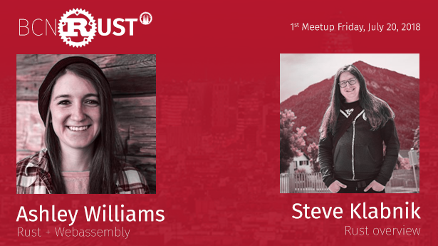

# 1er Meetup (20-07-2018)

En nuestro [primer meetup](https://www.meetup.com/es-ES/BcnRust/events/251237895/), tuvimos el honor de contar con [Ashley Williams](https://twitter.com/ag_dubs) y [Steve Klabnik](https://twitter.com/steveklabnik) que nos dieron unas charlas muy interesantes sobre `WASM`, `Rust 2018 Edition` y una `Breve introducción a Rust`.

[Ashley Williams](https://twitter.com/ag_dubs) hablando sobre `Rust + WASM`

<iframe width="560" height="315" src="https://www.youtube.com/embed/47M3TvrfmeY" frameborder="0" allow="autoplay; encrypted-media" allowfullscreen></iframe>

[Steve Klabnik](https://twitter.com/steveklabnik) nos cuenta las novedades de la `edición 2018`.

<iframe width="560" height="315" src="https://www.youtube.com/embed/v-vKobEbJ1s" frameborder="0" allow="autoplay; encrypted-media" allowfullscreen></iframe>

[Steve Klabnik](https://twitter.com/steveklabnik) hace una breve `introducción a Rust`.

<iframe width="560" height="315" src="https://www.youtube.com/embed/bG-Yq_XnWS8" frameborder="0" allow="autoplay; encrypted-media" allowfullscreen></iframe>
